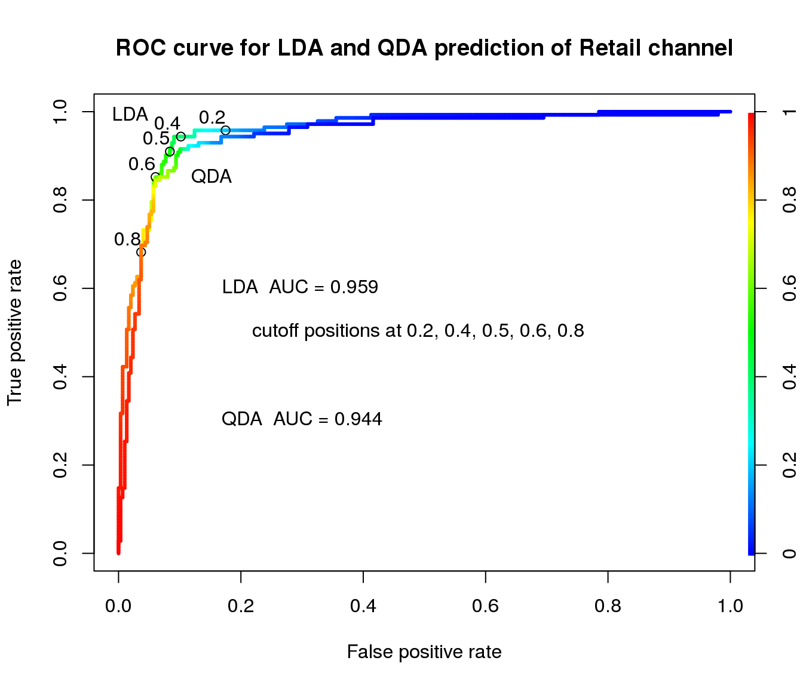
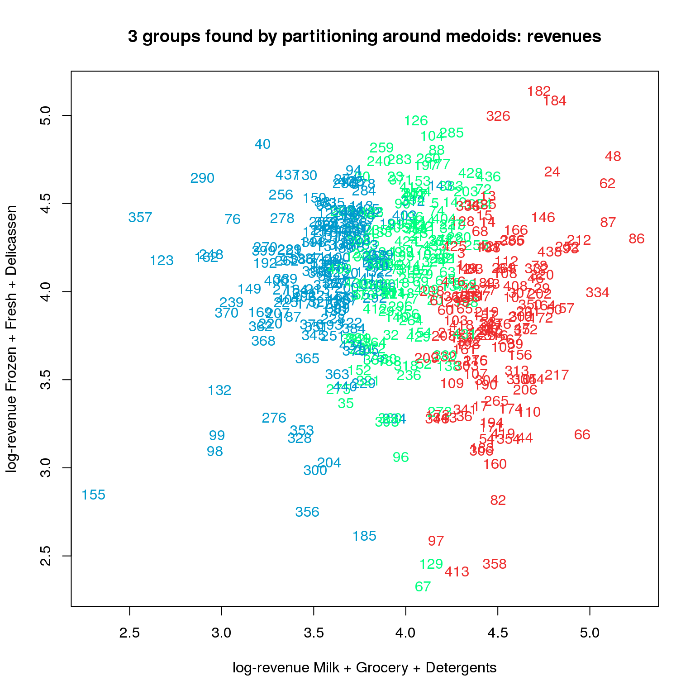
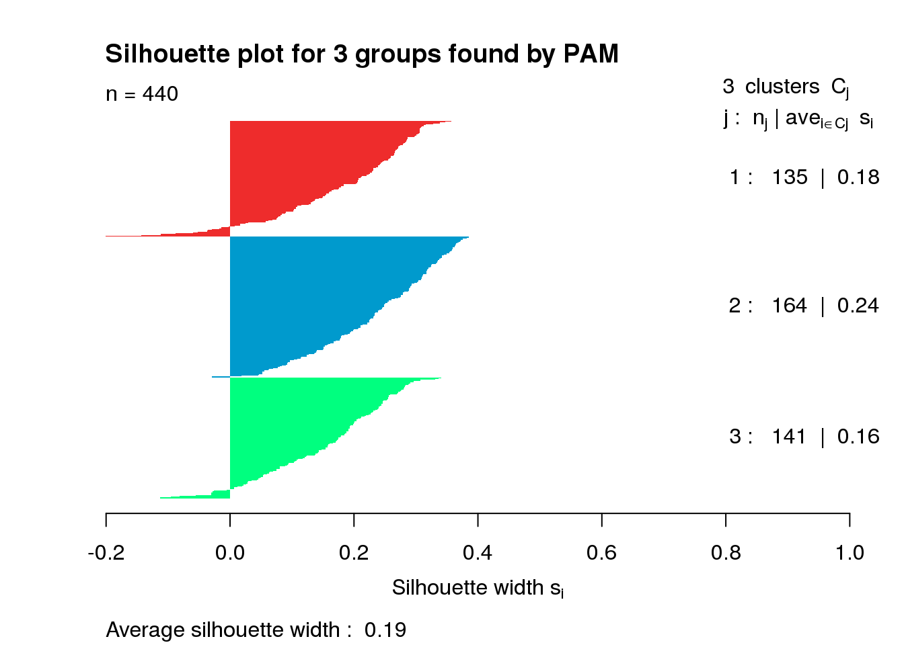
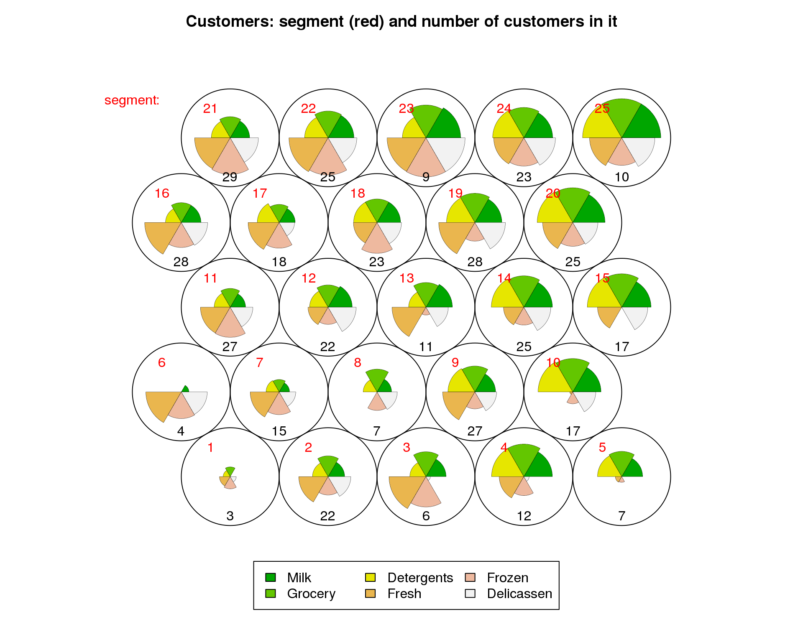

# Wholesale-multivariate-analysis
anova, discriminant analysis, (latent) factor analysis, clustering, customer segmentation

This [multivariate analysis](https://rawgit.com/olalakul/Wholesale-multivariate-analysis/master/wholesale-multivariate.html) includes

* ANOVA

* Discriminant analysis

* Factor analysis

* Clustering

* Customer segmentation

Some segments are pretty interesting.

5) Customers in segment 5 are buying very little (in comparison to average values) Fresh, Frozen and Delicassen.
Shouldn't you (as a careful businessmen) check why and what is going on?

6) Customers in segment 6 are buying very little Milk, Grocery, Detergent. Are you sure that you are a careful businessmen?

15) Customers in segment 15 need everything except Frozen. Why? Can it be that donating a refrigerator to them will boost their Frozen revenue to the level of other products (which are not small, by the way)? Is there a practice of such donations in the industry? 

23) Customers in segment 23 look like really large Cafes. Why do they want so little Detergents? Do they stick to  some specific brand that you do not have?

I also found 3 more segments that arise questions and opportunities.

